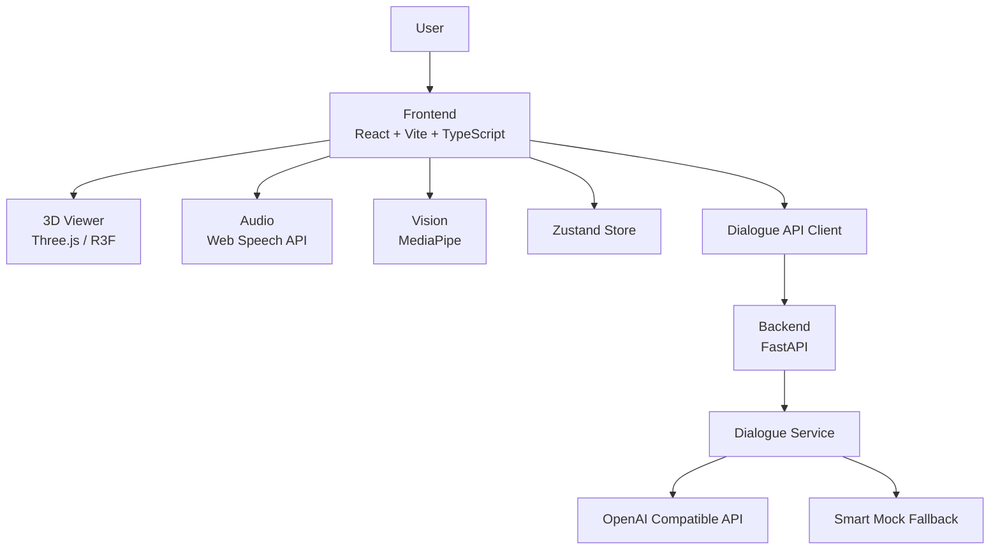

# MetaHuman Demo/SDK 技术架构

## 1. 架构目标

这份架构的目标不是描述一个“大而全的平台”，而是准确表达当前仓库如何跑通数字人交互闭环。

当前设计重点：
- 前端负责交互、渲染、浏览器侧语音与视觉能力
- 后端负责对话生成与统一接口输出
- 前后端通过最小稳定契约连接
- 任一外部能力异常时，系统尽量保持可演示

## 2. 总体架构



职责划分：

- 前端：页面组织、状态管理、3D 渲染、浏览器音视频能力、后端接口调用
- 后端：统一对话接口、会话消息管理、LLM 调用、失败降级
- 外部依赖：OpenAI 兼容接口、浏览器 Web Speech API、MediaPipe

## 3. 前端架构

### 3.1 入口与路由

入口：
- `src/main.tsx`
- `src/App.tsx`

当前路由：
- `/` → `AdvancedDigitalHumanPage`
- `/advanced` → `AdvancedDigitalHumanPage`
- `/digital-human` → `DigitalHumanPage`

其中默认体验页面为 `AdvancedDigitalHumanPage`，承担主要演示功能。

### 3.2 分层方式

前端可以按 4 层理解：

#### 1) 页面层 `src/pages/`
负责：
- 组织页面布局与面板组合
- 调度核心能力模块
- 响应用户事件
- 管理页面级 UI 状态

关键文件：
- `src/pages/AdvancedDigitalHumanPage.tsx`
- `src/pages/DigitalHumanPage.tsx`

#### 2) 组件层 `src/components/`
负责：
- 承载具体 UI 与交互模块
- 提供可复用的功能面板
- 尽量避免承载过多跨模块业务逻辑

关键组件：
- `DigitalHumanViewer.tsx`：3D 数字人展示
- `ControlPanel.tsx`：播放、重置、静音等快捷控制
- `VoiceInteractionPanel.tsx`：语音输入输出面板
- `VisionMirrorPanel.tsx`：视觉镜像面板
- `ExpressionControlPanel.tsx`：表情控制面板
- `BehaviorControlPanel.tsx`：行为控制面板

#### 3) 核心能力层 `src/core/`
负责：
- 抽离数字人、语音、对话、视觉等核心能力
- 对页面层提供更稳定的调用接口
- 隔离底层浏览器 API / 第三方库细节

关键模块：
- `src/core/avatar/DigitalHumanEngine.ts`
- `src/core/audio/audioService.ts`
- `src/core/dialogue/dialogueService.ts`
- `src/core/dialogue/dialogueOrchestrator.ts`
- `src/core/vision/visionService.ts`
- `src/core/vision/visionMapper.ts`

#### 4) 状态层 `src/store/`
负责：
- 存放全局共享状态
- 统一页面、组件、服务之间的状态同步

关键文件：
- `src/store/digitalHumanStore.ts`

### 3.3 前端关键模块说明

#### DigitalHumanEngine
位置：`src/core/avatar/DigitalHumanEngine.ts`

职责：
- 统一驱动数字人的播放、暂停、重置
- 管理表情、情绪、行为等表现状态
- 为页面层提供更高层的调用入口

#### audioService
位置：`src/core/audio/audioService.ts`

职责：
- 封装 TTS 与 ASR
- 对接浏览器 Web Speech API
- 与 store 同步录音、播报、静音等状态

说明：
- 该层依赖浏览器实现，不保证不同设备行为完全一致

#### dialogueService
位置：`src/core/dialogue/dialogueService.ts`

职责：
- 检查后端健康状态
- 发送用户输入到 `/v1/chat`
- 统一处理接口请求与失败情况

#### dialogueOrchestrator
位置：`src/core/dialogue/dialogueOrchestrator.ts`

职责：
- 接收后端返回的 `replyText / emotion / action`
- 协调聊天记录、数字人引擎、TTS 等多个模块
- 避免页面层直接堆叠联动逻辑

#### visionService / visionMapper
位置：
- `src/core/vision/visionService.ts`
- `src/core/vision/visionMapper.ts`

职责：
- 获取摄像头输入并运行视觉推理
- 将原始结果转换为更易消费的情绪/动作映射
- 降低页面层对 MediaPipe 原始输出的依赖

## 4. 后端架构

### 4.1 入口与路由

关键文件：
- `server/app/main.py`
- `server/app/api/chat.py`
- `server/app/services/dialogue.py`

当前接口：
- `GET /`
- `GET /health`
- `POST /v1/chat`

### 4.2 后端职责

后端在当前仓库中的职责非常明确：

- 提供最小稳定的对话 API
- 保存有限的会话历史
- 调用 OpenAI 兼容接口生成回复
- 在无 key、超时、网络错误、HTTP 错误等情况下自动回退 Mock

它当前**不是**：
- 通用 AI 网关
- 复杂业务后端
- 生产级会话存储系统

### 4.3 DialogueService

位置：`server/app/services/dialogue.py`

职责：
- 根据用户输入生成结构化回复
- 管理会话上下文
- 构造 system prompt
- 调用上游 LLM
- 对异常进行降级处理

当前输出结构固定为：

```json
{
  "replyText": "string",
  "emotion": "neutral|happy|surprised|sad|angry",
  "action": "idle|wave|greet|think|nod|shakeHead|dance|speak"
}
```

实现特点：
- 无 `OPENAI_API_KEY` 时直接走智能 Mock
- LLM 返回非法 JSON 时，仍尽量退化为可显示结果
- 支持基于 `sessionId` 的简易会话历史
- `OPENAI_BASE_URL` 支持多种输入形式并自动规范化

### 4.4 状态与存储约束

当前会话历史保存在内存中：
- 适合 Demo、本地开发、简单联调
- 不适合生产环境持久化与多实例部署

如果后续要走生产化，建议替换为 Redis 或数据库。

## 5. 关键数据流

### 5.1 文本输入链路

```text
用户输入文本
→ 页面层触发 sendUserInput
→ 前端请求 POST /v1/chat
→ 后端 DialogueService 生成 replyText/emotion/action
→ 前端编排层 handleDialogueResponse
→ 更新聊天区 / 数字人状态 / TTS 播报
```

### 5.2 语音输入链路

```text
用户开始录音
→ ASR 识别文本
→ 识别结果进入 sendUserInput
→ 后续与文本输入链路一致
```

### 5.3 视觉镜像链路

```text
摄像头授权
→ visionService 获取视频并推理
→ visionMapper 输出简化状态
→ 页面或引擎消费该状态
→ 数字人表现发生变化
```

## 6. 接口契约

### 6.1 GET /health

用途：
- 健康检查
- 判断后端是否可达
- 判断当前是否处于 LLM 可用或 Mock 模式

示例返回：

```json
{
  "status": "ok",
  "uptime_seconds": 12.34,
  "version": "1.0.0",
  "services": {
    "chat": "available",
    "llm": "available"
  }
}
```

当未配置 `OPENAI_API_KEY` 时：
- `services.llm = "mock_mode"`

### 6.2 POST /v1/chat

请求：

```json
{
  "sessionId": "optional-session-id",
  "userText": "你好",
  "meta": {
    "timestamp": 1234567890
  }
}
```

响应：

```json
{
  "replyText": "您好！很高兴见到您，有什么可以帮助您的吗？",
  "emotion": "happy",
  "action": "wave"
}
```

契约原则：
- 前端依赖结构化结果，而不是任意自然语言
- 后端负责把 LLM 不稳定输出收敛为稳定结构
- 前端不直接接触上游模型协议

## 7. 配置与安全约束

### 7.1 前端配置
- `VITE_API_BASE_URL`：后端地址

### 7.2 后端配置
- `OPENAI_API_KEY`
- `OPENAI_MODEL`
- `OPENAI_BASE_URL`
- `CORS_ALLOW_ORIGINS`
- `LLM_PROVIDER`（当前为扩展预留）

### 7.3 安全边界
- API Key 仅应存在于后端环境变量中
- 前端不应持有或透传密钥
- 摄像头 / 麦克风能力必须建立在用户授权之上
- 浏览器能力失败时应以降级而不是崩溃为目标

## 8. 当前架构优点

- 结构足够简单，便于快速理解和演示
- 前后端边界比较清楚
- 接口契约稳定，利于页面与服务解耦
- 支持无云端配置演示，适合 PoC 和售前场景
- 关键能力有明确模块入口，适合继续二开

## 9. 当前架构限制

- 会话历史仅内存存储，不适合生产
- 浏览器语音与视觉能力受设备/环境影响较大
- 动作/情绪集合仍然偏简化，主要服务演示
- 页面层仍承担一定编排职责，后续可继续收敛
- 当前更偏样例工程，不是通用 SDK 形态

## 10. 演进方向建议

### 短期
- 继续收敛页面层逻辑到编排层
- 补齐更多状态边界与错误展示
- 明确视觉驱动与对话驱动的优先级策略

### 中期
- 抽象更清晰的适配接口，增强 SDK 化能力
- 支持可替换的对话服务提供方
- 增强动作、表情、场景配置能力

### 长期
- 在明确业务需求后，再考虑平台化与后台化建设

## 11. 结论

当前仓库的最佳架构描述应是：

> 一个以前端交互闭环为核心、以后端最小对话服务为支撑的数字人 Demo/SDK 架构。

这个描述既符合现状，也能为后续演进保留空间。