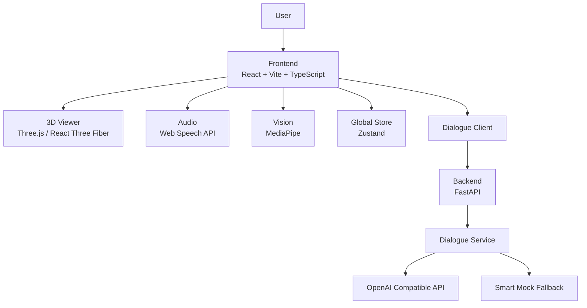

# MetaHuman 架构说明

## 1. 文档目的

本文档用于说明当前仓库的真实架构边界、模块职责与关键数据流。

它服务于三个目标：
- 帮助开发者快速理解代码结构
- 帮助协作者判断应该在哪一层修改功能
- 确保架构描述与当前实现一致，而不是写成超出代码能力的“平台方案”

当前仓库定位为：

> 一个聚焦数字人交互闭环验证的 Web Demo/SDK。

## 2. 架构边界

当前仓库主要覆盖以下能力：
- 3D 数字人渲染
- 文本 / 语音输入输出
- 摄像头视觉镜像与基础推理
- 后端对话接口
- 前后端联调与失败降级

当前明确不覆盖：
- 用户系统与权限管理
- 模型资产管理后台
- 复杂行为编排平台
- 多租户、灰度、运营后台
- 生产级持久化与监控体系

## 3. 总体架构



职责划分：
- 前端：UI、渲染、浏览器侧语音与视觉能力、状态同步、接口调用
- 后端：统一对话契约、会话消息管理、LLM 调用、异常降级
- 外部依赖：Web Speech API、MediaPipe、OpenAI 兼容接口

## 4. 前端架构

### 4.1 入口与路由

入口文件：
- `src/main.tsx`
- `src/App.tsx`

路由：
- `/` → `AdvancedDigitalHumanPage`
- `/advanced` → `AdvancedDigitalHumanPage`
- `/digital-human` → `DigitalHumanPage`

说明：
- `AdvancedDigitalHumanPage` 是当前默认与最完整的演示页
- `DigitalHumanPage` 是更轻量的简化版页面

### 4.2 页面层

目录：`src/pages/`

职责：
- 组织布局和模块组合
- 响应用户操作
- 调用核心能力模块
- 管理页面级状态

关键页面：
- `src/pages/AdvancedDigitalHumanPage.tsx`
- `src/pages/DigitalHumanPage.tsx`

### 4.3 组件层

目录：`src/components/`

职责：
- 承载可复用的 UI 组件与功能面板
- 聚焦交互展示，避免堆叠过多跨模块逻辑

关键组件：
- `DigitalHumanViewer.tsx`：数字人渲染视图
- `ControlPanel.tsx`：播放、重置、录音、静音等快捷控制
- `VoiceInteractionPanel.tsx`：语音输入输出面板
- `VisionMirrorPanel.tsx`：摄像头画面与视觉识别展示
- `ExpressionControlPanel.tsx`：表情调试
- `BehaviorControlPanel.tsx`：行为调试

### 4.4 核心能力层

目录：`src/core/`

职责：
- 对页面层暴露更稳定的高层接口
- 屏蔽底层浏览器 API 与第三方库细节
- 将数字人、语音、对话、视觉能力拆分为独立模块

关键模块：

#### `src/core/avatar/DigitalHumanEngine.ts`
职责：
- 驱动播放、暂停、重置
- 管理表情、情绪、动作等表现状态
- 提供统一的数字人行为入口

#### `src/core/audio/audioService.ts`
职责：
- 封装 TTS / ASR
- 对接 Web Speech API
- 同步录音、播报、静音等状态

约束：
- 依赖浏览器实现，不保证跨设备一致

#### `src/core/dialogue/dialogueService.ts`
职责：
- 调用后端 `/v1/chat`
- 检查服务健康状态
- 统一处理接口错误与降级体验

#### `src/core/dialogue/dialogueOrchestrator.ts`
职责：
- 消费结构化回复 `replyText / emotion / action`
- 协调聊天区、数字人引擎、TTS 等模块更新
- 减少页面层直接编排细节

#### `src/core/vision/visionService.ts`
职责：
- 管理摄像头输入
- 驱动 MediaPipe 推理流程

#### `src/core/vision/visionMapper.ts`
职责：
- 将视觉原始结果映射为更易消费的情绪/动作信号
- 降低页面层对原始关键点数据的依赖

### 4.5 状态层

目录：`src/store/`

关键文件：
- `src/store/digitalHumanStore.ts`

职责：
- 存放全局共享状态
- 协调页面、组件和服务之间的数据同步

当前关键状态包括：
- 会话：`sessionId`
- 播放与音频：`isPlaying`、`isRecording`、`isMuted`、`isSpeaking`
- 表情与行为：`currentEmotion`、`currentExpression`、`currentAnimation`
- 系统状态：`connectionStatus`、`error`

设计原则：
- UI 优先通过 store 与高层 action 协作
- 尽量避免组件直接操作底层 API

## 5. 后端架构

### 5.1 入口与目录

后端目录：`server/app/`

关键文件：
- `server/app/main.py`：FastAPI 入口
- `server/app/api/chat.py`：对话路由
- `server/app/services/dialogue.py`：对话服务实现

当前接口：
- `GET /`
- `GET /health`
- `POST /v1/chat`

### 5.2 后端职责

后端当前只承担最小必要职责：
- 对外提供稳定的对话接口
- 接收 `sessionId / userText / meta`
- 调用 LLM 或回退 Mock
- 返回前端可直接消费的结构化结果

它当前不是通用平台后端，也不承担复杂业务系统职责。

### 5.3 DialogueService

位置：`server/app/services/dialogue.py`

职责：
- 生成结构化回复
- 管理简易会话历史
- 维护 system prompt
- 调用 OpenAI 兼容接口
- 在失败时自动回退智能 Mock

当前输出结构：

```json
{
  "replyText": "string",
  "emotion": "neutral|happy|surprised|sad|angry",
  "action": "idle|wave|greet|think|nod|shakeHead|dance|speak"
}
```

实现特点：
- 未配置 `OPENAI_API_KEY` 时直接走 Mock
- LLM 返回非法 JSON 时尽量退化为可显示结果
- 支持基于 `sessionId` 的有限会话上下文
- `OPENAI_BASE_URL` 支持多种输入格式并自动规范化

### 5.4 存储限制

当前会话历史存于内存：
- 适合 Demo、本地开发、联调
- 不适合生产环境持久化、多实例部署

若后续生产化，建议引入 Redis 或数据库。

## 6. 关键数据流

### 6.1 文本输入链路

```text
用户输入文本
→ 页面层触发 sendUserInput
→ 前端请求 POST /v1/chat
→ 后端生成 replyText / emotion / action
→ 前端 orchestrator 编排结果
→ 更新聊天区 / 数字人状态 / TTS 播报
```

### 6.2 语音输入链路

```text
用户开始录音
→ ASR 识别文本
→ 识别结果进入 sendUserInput
→ 后续与文本输入链路一致
```

### 6.3 视觉镜像链路

```text
用户授权摄像头
→ visionService 获取视频流并推理
→ visionMapper 输出简化状态
→ 页面或引擎消费映射结果
→ 数字人表现层更新
```

## 7. 架构设计原则

- 优先保证演示闭环稳定，而不是追求平台复杂度
- 前后端通过最小稳定契约通信
- 页面层尽量编排，核心能力尽量下沉到 `core/`
- 出错时优先降级，而不是让整条链路中断
- 文档必须和当前实现一致

## 8. 当前优点与限制

### 优点
- 结构简单，容易理解与演示
- 前后端边界清晰
- 支持无云端配置运行
- 关键能力入口明确，便于二开

### 限制
- 会话历史仍是内存态
- 浏览器语音/视觉能力依赖环境
- 动作与情绪集合偏简化
- 页面层仍承担部分编排职责
- 更偏样例工程，而非通用 SDK 产品形态

## 9. 推荐演进方向

### 短期
- 继续下沉页面逻辑到 orchestrator / service
- 完善权限、空状态、错误状态展示
- 明确多输入源之间的优先级与协同策略

### 中期
- 抽象更清晰的 SDK 接口层
- 支持可替换的对话服务提供方
- 增强动作、表情与场景扩展能力

### 长期
- 仅在明确业务需求后，再考虑平台化建设

## 10. 结论

当前最准确的架构定义是：

> 一个以前端交互闭环为核心、以后端最小对话服务为支撑的数字人 Demo/SDK 架构。

这一定义既符合代码现状，也为后续演进留出了空间。